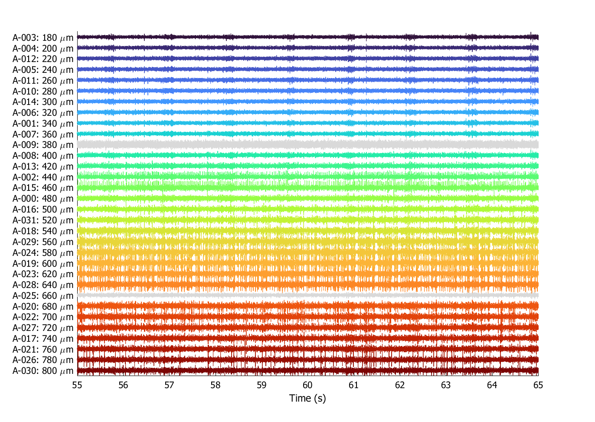

# Rodent_DRG
Code for analyzing data from rodent DRG recordings.

## Setup ##
### Installing MATLAB Code ###
Follow the steps in [this guide](https://code.nml.wtf/tutorials/2022/06/26/credentials) if you think you will use version-control to contribute. If you just want the code, then you can download the zip file directly and unzip or using a `git bash` terminal by right-clicking in the folder where you want this repo folder to appear, click `git bash` (or in Win11, click "More Options..." first), then input the following command:  
```(git)
git clone --recurse-submodules git@github.com:Neuro-Mechatronics-Interfaces/Rodent_DRG.git
```  
If you get a message about permissions, you probably need to set up `ssh` credentials for your GitHub account (following the previous link).  

### Mapping Raptor Data Share ###
If you have not already mapped the NI `raptor` datashare, follow the steps in [this guide](https://nml-wiki.org/andrew.cmu.edu/nml-wiki/documentation/it/ni-raptor-datashare) to do so. You will need to be logged into your `andrew.cmu.edu` account via the web browser in order to see instructions.  

## Contents ##
By convention, most code contains documentation in comments in the docstrings of the header of the function directly. Where possible, the newer `arguments` block is added to functions to help clarify what should be input. Examples of function use are typically in any of the `eda__...` scripts or script names that start with `example_...`

### Submodules ###
* `+cm` - Contains custom colormaps and a class for interpolating colors given a colormap and range of color values.
* `+default` - Just contains some utility code for "default" versions of in-built functions like MATLAB `savefig,` so they do stuff Max likes.  
* `+io` - Contains utilities for loading data files specific to data structures used by Max at NML. Tends to be used more with data stored on `raptor` data share.  
* `+utils` - Random utilities that have accumulated over the years and sometimes referenced by the other packages. I don't even know if it's needed, but the answer is "probably." Whoops.  

---

### Scripts ###
Scripts starting with `eda__...` are ad hoc analyses pertaining to a specific experiment. Scripts starting with `example_...` show how miscellaneous code in the application-specific MATLAB functions in this repo are used to process ad hoc experiments.  

---  

## Example Data ##  
### DW100: 2023-08-09 ###  
Most of these analyses will look at the probe mapping to ensure the correct laminar arrangement of electrodes using the "virtual channel" schema from the Intan acquisition system.  
#### Figure 1: Example Snippet with Laminar Arrangement ####  
  
This is an example of ten seconds from a recording on a 32-contact linear array from NeuroNexus, inserted to the upper laminae (dorsal root ganglion -- in the lumbar enlargement?), during light mechanosensory stimulation while under isoflurane anesthesia.  
With a distance of roughly 20-microns from the center-to-center of each recording electrode, it's clear that adjacent electrodes detect correlated extracellular field potential fluctuations generated by the same cell or subset of cells. These correlations appear to decline over the count of anywhere from 3 (red traces) to 5 (orange traces), presumably due to either the proximity to a cell (source) or the size of the cell generating the spikes.  
##### Questions #####  
1. What spinal level is this recording taken from?   
2. There is a periodic structure, particularly evident on the upper channels, which appears to be just at or under 1-Hz. This is consistent with the respiratory rate of the animal, which was fluctuating between 40-50 breathes/minute around this time.  
  - [ ] Is there any chance that these signals are related to mechanosensory activation of the periphery, as the pressure from inspiration/exhalation causes a slight mechanical disturbance throughout the musculoskeletal system in contact with the foam padding?  
  